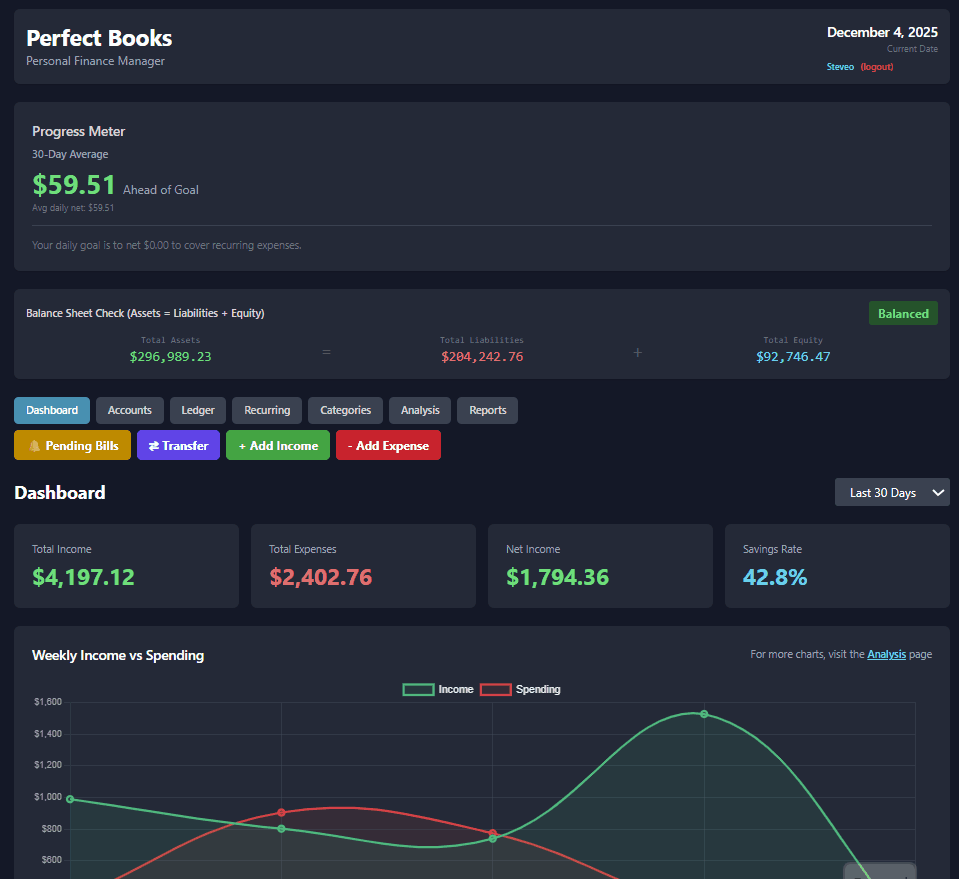
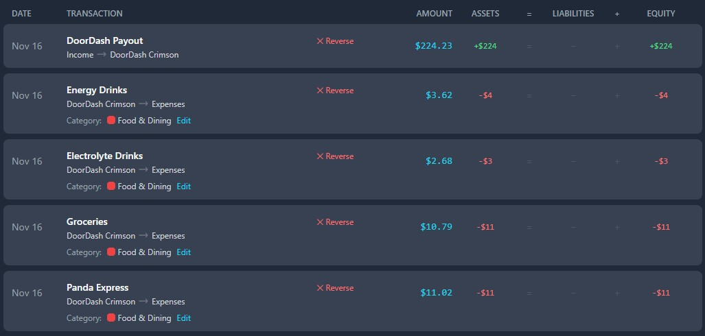

# Perfect Books - Personal Finance Management

[](https://www.python.org/)
[](https://www.sqlite.org/)
[](https://reactjs.org/)
[](https://flask.palletsprojects.com/)
[](https://tailwindcss.com/)

> A sophisticated, **portable** personal finance application built on double-entry accounting principles. Single-file database, no server required, works on Mac and Windows.

### 🚀 Live Demo

**[Explore the Live Application Here](https://web-production-4abea.up.railway.app/index.html)**

*Note: This is a live portfolio demo. Please feel free to register a test account and explore the features. As this is not a production environment, please use dummy data for all entries.*

---

## 📋 Table of Contents

- [About the Project](#about-the-project)
- [Why SQLite? (New in v3.0)](#why-sqlite-new-in-v30)
- [Demo](#demo)
- [Core Features](#core-features)
- [Tech Stack](#tech-stack)
- [Getting Started](#getting-started)
  - [Prerequisites](#prerequisites)
  - [Installation](#installation)
  - [Running the Application](#running-the-application)
- [Architecture](#architecture)
- [Database Schema](#database-schema)
- [API Documentation](#api-documentation)
- [Migration Guide](#migration-guide)
- [Roadmap](#roadmap)
- [Related Projects](#related-projects)
- [Contributing](#contributing)
- [License](#license)
- [Contact](#contact)

---

## 🎯 About the Project

**Perfect Books** is a full-stack personal finance application that brings **professional accounting principles** to personal money management. Unlike typical budgeting apps, Perfect Books maintains a complete **double-entry accounting system**, ensuring every transaction is accurately recorded and balanced.

Now fully portable with SQLite - no database server needed! Send the folder to anyone on Mac or Windows and they can start tracking finances immediately.

### Why I Built This

As an independent contractor managing multiple credit cards, loans, and fluctuating income streams, I needed a comprehensive view of my financial position that standard budgeting apps couldn't provide. After years of analyzing sales and inventory data in retail, I wanted to apply the same analytical rigor to my personal finances.

The problem was clear: I had accounts scattered across multiple institutions, debt I wanted to track systematically, and no single tool that gave me a complete picture. Most personal finance apps treat accounts in isolation, but I needed something that worked like a real accounting system - where every transaction is balanced and my overall financial health is always accurate.

Perfect Books solves this by treating personal finances like a business. Built on the same double-entry accounting foundation as my [Digital Harvest](https://github.com/matthew-s-jenkins/digital-harvest-sim) business simulator, it gives me enterprise-grade financial tracking with a clean, modern interface.

### What It Does

Perfect Books allows you to:
- **Manage multiple accounts** (checking, savings, credit cards, loans) with proper double-entry accounting
- **See real-time net worth** - total assets minus liabilities updated with every transaction
- **Track all debt in one place** - credit cards and loans with combined balance visualization
- **Automate recurring bills** with category-based organization and variable amount support
- **Simulate time** to see how recurring expenses and income affect your finances
- **Maintain an immutable audit trail** - no transaction is ever truly deleted, only reversed
- **Run anywhere** - Single database file, no server installation needed

### Technical Highlights

- **Double-Entry Ledger**: Every transaction creates balanced DR/CR entries, maintaining accounting integrity
- **SQLite Database**: Portable single-file database with full ACID compliance
- **Stateless API Architecture**: Flask REST API with secure session-based authentication
- **Immutable Audit Trail**: Transaction UUIDs group related ledger entries for reversal and tracking
- **Multi-User Security**: Complete data isolation with bcrypt password hashing
- **Cross-Platform**: Works identically on Mac and Windows
- **Easy Distribution**: Send one folder to beta testers - no setup required

**Related Project:** [Digital Harvest](https://github.com/matthew-s-jenkins/digital-harvest-sim) - A business simulation that shares the same accounting architecture

---

## 🆕 Why SQLite? (New in v3.0)

### The Portability Revolution

Perfect Books v3.0 represents a complete rewrite from MySQL to SQLite, transforming it from a server-dependent application to a **fully portable personal finance tool**.

**Benefits of SQLite:**
- ✅ **Zero Configuration**: No database server to install or configure
- ✅ **Single File**: Entire financial history in one `.db` file
- ✅ **Cross-Platform**: Works identically on Mac and Windows
- ✅ **Easy Backup**: Just copy one file
- ✅ **Perfect for Personal Use**: Designed for single-user scenarios
- ✅ **Simple Distribution**: Send folder to sister/girlfriend - it just works!
- ✅ **Professional Quality**: Full ACID compliance, same reliability as MySQL

**Migration Stats:**
- **76 code fixes** applied for full compatibility
- **689 rows** of personal data migrated successfully
- **Zero data loss** - complete transaction history preserved
- **Same features** - all functionality maintained

See [MIGRATION_GUIDE.md](MIGRATION_GUIDE.md) for complete technical details.

---

## 🎬 Demo

### Interactive Web Dashboard



*Multi-page React interface with real-time financial tracking, expense categorization, and automated recurring bill management.*

### Double-Entry Ledger Display



*Transaction ledger showing balanced DR/CR entries with running balance calculation. Every transaction maintains accounting integrity with proper debits and credits.*

---

## 💡 Technical Challenges Solved

### 1. Double-Entry Accounting Implementation

The core challenge was implementing a true double-entry accounting system where every transaction creates balanced ledger entries. This required:

- **Transaction UUIDs**: Grouping related debit/credit entries together for atomic operations
- **Immutable Ledger**: Append-only design prevents data corruption - transactions can be reversed but never deleted
- **Running Balance Calculation**: Efficient SQL queries that calculate account balances on-the-fly while maintaining audit trail
- **Reversal Logic**: Creating offsetting entries that preserve the complete transaction history

This design ensures financial integrity - the books always balance, and every cent is accounted for.

### 2. MySQL to SQLite Migration

Migrating from MySQL to SQLite while preserving all functionality required solving:

- **Type System Differences**: Converting DECIMAL to TEXT, BOOLEAN to INTEGER, DATETIME to TEXT
- **Function Replacements**: Translating MySQL-specific functions (`DATE_FORMAT`, `YEARWEEK`) to SQLite equivalents
- **Row Object Handling**: Converting sqlite3.Row objects to dictionaries for JSON serialization
- **Date Arithmetic**: Handling datetime stored as TEXT strings
- **Query Parameters**: Converting datetime objects to strings for SQL queries

**Result:** 76 systematic fixes applied, zero features lost, full backward compatibility maintained.

### 3. Account Filtering with Running Balance

Building the account-filtered ledger view required complex SQL to:
- Show all transactions involving a specific account (both sides of the entry)
- Calculate running balance that updates correctly as you scroll through history
- Handle grouped transactions (transfers, reversals) properly
- Maintain performance even with thousands of transactions

The solution uses CTEs and window functions to efficiently calculate balances without loading the entire ledger into memory.

### 4. Variable Recurring Transactions

Real-world bills and income often vary month-to-month. I built a pending transaction approval system that:
- Stores estimated amounts for recurring items
- Generates pending transactions when due
- Allows users to approve with actual amounts before posting to the ledger
- Tracks variance between estimated and actual for future forecasting

This mirrors real business expense management workflows.

---

## ✨ Core Features

### 💰 Financial Management

- **Multi-Account Support**: Track checking, savings, credit cards, cash, loans, and investments
- **Real-Time Balance Tracking**: All account balances update automatically with every transaction
- **Net Worth Calculation**: See your total assets minus liabilities at a glance
- **Transfer Between Accounts**: Move money with proper double-entry accounting

### 📈 Income & Expense Tracking

- **Expense Categorization**: Custom categories with color coding (10 default categories included)
- **Income Tracking**: Log all income sources with descriptions
- **Transaction History**: Complete, immutable ledger with advanced filtering
- **Pagination Support**: "Load More" button to view up to 100 transactions per session
- **Date Range Filtering**: Filter transactions by start date, end date, or date range
- **Account Filtering**: Filter ledger by specific account with running balance display
- **Color-Coded Amounts**: Green for increases, red for decreases when viewing single account
- **Transaction Reversal**: Reverse incorrect transactions with dedicated tracking fields (is_reversal, reversal_of_id)
- **Reversal Filtering**: Toggle to show/hide reversals in ledger view (excluded from totals by default)
- **Category Analytics**: See spending breakdown by category
- **CSV Export**: Export filtered transaction data for external analysis

### 🔄 Recurring Transactions

- **Automated Bills**: Set up monthly recurring expenses (rent, subscriptions, etc.)
- **Category Assignment**: Each recurring expense can have a category
- **Payment Automation**: Bills auto-pay on due date during time advancement
- **Visual Indicators**: Color-coded category badges show at a glance

### 💳 Loan Management

- **Debt Tracking**: Monitor outstanding balances and payment schedules
- **Payment Processing**: Make loan payments with proper accounting
- **Interest Calculation**: Automatic interest accrual
- **Amortization Tracking**: See principal vs interest breakdown

### 🔐 Security & Multi-User

- **User Authentication**: Secure registration and login with bcrypt
- **Session Management**: Flask-Login for secure session handling
- **Data Isolation**: Complete segregation - users can only see their own data
- **Password Security**: Industry-standard bcrypt hashing

### 💾 Automatic Backup & Restore

- **Auto-Backup on Startup**: Your data is automatically backed up every time you launch the app
- **Safe Updates**: Delete the app folder, download a new version - your data restores automatically!
- **Rolling Backups**: Keeps 3 daily backups + 4 weekly backups (created on Sundays)
- **Cross-Platform Storage**: Backups stored in `Documents/PerfectBooks_Data/`
- **Zero Effort**: No manual backup needed - it just works

---

## 🛠️ Tech Stack

| Component | Technology | Purpose |
|-----------|-----------|---------|
| **Backend** | Python 3.8+ | Business logic and simulation engine |
| **Database** | **SQLite 3** | Portable single-file database with ACID compliance |
| **API** | Flask + Flask-Login | RESTful API with session authentication |
| **Frontend** | React 18 | Interactive single-page application |
| **Styling** | Tailwind CSS | Modern, responsive UI design |
| **Security** | bcrypt | Password hashing and authentication |
| **Analytics** | Power BI / Tableau | Business intelligence dashboards (via ODBC) |

---

## 🚀 Getting Started

### Prerequisites

- **Python 3.8+** installed ([Download](https://www.python.org/downloads/))
- A modern web browser (Chrome, Firefox, or Edge recommended)
- **That's it!** No database server needed!

### Installation

#### Option 1: Simple Launcher (Recommended)

**Windows:**
1. Download or clone the repository
2. Double-click `START_WINDOWS.bat`
3. Your browser will open to the login page automatically!

**Mac:**
1. Download or clone the repository
2. Double-click `START_MAC.command`
3. If you see a security warning, right-click and choose "Open"
4. Your browser will open to the login page automatically!

#### Option 2: Manual Installation

1. **Clone the repository**
   ```bash
   git clone https://github.com/yourusername/perfect-books.git
   cd perfect-books
   ```

2. **Install Python dependencies**
   ```bash
   pip install -r requirements.txt
   ```

3. **Run the application**
   ```bash
   python start.py
   ```

   Your browser will open to `http://127.0.0.1:5001` automatically!

### First-Time Setup

On first run, Perfect Books will:
1. Create the `src/data/` folder
2. Initialize `perfectbooks.db` with the schema
3. Launch the Flask server
4. Open your browser to the login page

**Create your account:**
- Click "Register" on the login page
- Choose a username and password
- Start tracking your finances!

### Running the Application

**Simplest Way:**
- **Windows**: Double-click `START_WINDOWS.bat`
- **Mac**: Double-click `START_MAC.command`

**Command Line:**
```bash
python start.py
```

**What Happens:**
```
============================================================
Perfect Books - Personal Finance Manager
============================================================

[1/5] Checking Python version... [OK] Python 3.13.1
[2/5] Checking dependencies... [OK]
[3/5] Database found... [OK]
[4/5] Checking for migrations... [OK] No pending migrations
[5/5] Starting Perfect Books server...

============================================================
Perfect Books is running!
============================================================

  Server: http://127.0.0.1:5001
  Press Ctrl+C to stop the server
```

---

## 🏗️ Architecture

### Portable Design

Perfect Books uses a **portable, stateless architecture**:
- All state stored in a single SQLite database file
- No external dependencies (no MySQL server, no Redis, no nothing!)
- Works from any directory on any operating system
- Database automatically created on first run
- Complete transaction history in one `.db` file

### Cross-Platform Compatibility

```
┌─────────────────────┐
│  START_WINDOWS.bat  │  or  │  START_MAC.command  │
│   (One-click run)   │      │   (One-click run)    │
└──────────┬──────────┘      └──────────┬───────────┘
           │                             │
           └─────────────┬───────────────┘
                         ↓
                 ┌───────────────┐
                 │   start.py    │  ← Cross-platform launcher
                 └───────┬───────┘
                         │
                         ↓
            ┌─────────────────────┐
            │  Flask API Server   │
            │  (Port 5001)        │
            └──────────┬──────────┘
                       │
                       ↓
            ┌─────────────────────┐
            │ Business Engine     │ ← Stateless methods
            └──────────┬──────────┘
                       │
                       ↓
            ┌─────────────────────┐
            │ SQLite Database     │ ← Single file
            │ perfectbooks.db     │
            └─────────────────────┘
```

### Security Model

```
┌─────────────┐
│   Browser   │
│  (React UI) │
└─────┬───────┘
      │ HTTP (localhost only)
      ↓
┌─────────────────┐
│  Flask API      │
│  + Flask-Login  │ ← Session cookies
└────────┬────────┘
         │ Validates user_id on every request
         ↓
┌─────────────────┐
│ Business Engine │ ← Stateless methods
└────────┬────────┘
         │
         ↓
┌─────────────────┐
│  SQLite Database│ ← User data segregated
│  (Single File)  │
└─────────────────┘
```

### Double-Entry Accounting

Every financial transaction creates balanced ledger entries:

**Example: Pay $50 for groceries from checking**
```
DR: Expenses         $50  (increase)
CR: Checking Account $50  (decrease)
```

**Example: Transfer $100 from checking to savings**
```
DR: Savings Account  $100 (increase)
CR: Checking Account $100 (decrease)
```

---

## 🗄️ Database Schema

The database follows **normalized design principles** with referential integrity:

### Core Tables

| Table | Purpose | Key Columns |
|-------|---------|-------------|
| `users` | Authentication | user_id, username, password_hash |
| `accounts` | Financial accounts | account_id, user_id, name, type, balance |
| `financial_ledger` | **Double-entry ledger** | entry_id, user_id, transaction_uuid, account, debit, credit, category_id, is_reversal, reversal_of_id |
| `parent_categories` | Category hierarchy | parent_id, name, type (income/expense/both), display_order |
| `expense_categories` | Expense categories | category_id, user_id, name, color, parent_id |
| `income_categories` | Income categories | category_id, user_id, name, color, parent_id |
| `recurring_expenses` | Automated bills | expense_id, user_id, description, amount, due_day_of_month, category_id |
| `recurring_income` | Automated income | income_id, user_id, description, amount, day_of_month |
| `loans` | Debt tracking | loan_id, user_id, outstanding_balance, monthly_payment |

### Key Design Decisions

- **Foreign Keys**: Enforce referential integrity between tables (enabled with `PRAGMA foreign_keys = ON`)
- **Cascade Deletes**: Deleting a user removes all their data automatically
- **Indexes**: Optimized for common queries (user_id, transaction_date, category_id)
- **TEXT for Money**: All money values stored as TEXT for exact decimal precision
- **TEXT for Dates**: Dates stored in ISO format (`YYYY-MM-DD` or `YYYY-MM-DD HH:MM:SS`)
- **INTEGER for Booleans**: 0 = False, 1 = True
- **Immutable Ledger**: Financial ledger is append-only for audit trail (no edits/deletes, only reversals)
- **Transaction UUIDs**: Group related ledger entries for reversal and tracking
- **CHECK Constraints**: Replace MySQL ENUM types (e.g., `type TEXT CHECK(type IN ('CHECKING','SAVINGS'))`)

### SQLite-Specific Features

```sql
-- Example table definition
CREATE TABLE accounts (
    account_id INTEGER PRIMARY KEY AUTOINCREMENT,
    user_id INTEGER NOT NULL,
    name TEXT NOT NULL,
    type TEXT CHECK(type IN ('CHECKING', 'SAVINGS', 'CREDIT_CARD', 'CASH', 'LOAN')) NOT NULL,
    balance TEXT NOT NULL DEFAULT '0.00',
    is_default INTEGER DEFAULT 0,
    created_at TEXT DEFAULT CURRENT_TIMESTAMP,
    FOREIGN KEY (user_id) REFERENCES users(user_id) ON DELETE CASCADE
);

CREATE INDEX idx_accounts_user ON accounts(user_id);
```

---

## 📡 API Documentation

All endpoints remain unchanged from MySQL version. The API is backend-agnostic.

### Authentication Endpoints

| Method | Endpoint | Description |
|--------|----------|-------------|
| POST | `/api/register` | Register new user |
| POST | `/api/login` | Login with credentials |
| POST | `/api/logout` | End session |
| GET | `/api/check_auth` | Verify authentication |

### Account Endpoints

| Method | Endpoint | Auth | Description |
|--------|----------|------|-------------|
| GET | `/api/accounts` | ✓ | Get all user accounts |
| POST | `/api/account` | ✓ | Create new account |
| PUT | `/api/account/<id>` | ✓ | Update account |
| DELETE | `/api/account/<id>` | ✓ | Delete account |

### Transaction Endpoints

| Method | Endpoint | Auth | Description |
|--------|----------|------|-------------|
| GET | `/api/ledger` | ✓ | Get transaction history with pagination and filtering |
| POST | `/api/income` | ✓ | Log income |
| POST | `/api/expense` | ✓ | Log expense (with category) |
| POST | `/api/transfer` | ✓ | Transfer between accounts |
| POST | `/api/reverse_transaction` | ✓ | Reverse a transaction |

See full API documentation in the original README or via Swagger (coming soon).

---

## 📚 Migration Guide

**Migrating from MySQL to SQLite?** See [MIGRATION_GUIDE.md](MIGRATION_GUIDE.md) for:
- Complete step-by-step migration process
- All 76 code fixes documented
- Common errors and solutions
- Data export/import scripts
- Testing checklist

**Perfect for migrating similar projects** (Digital Harvest, other Flask+MySQL apps)

---

## 🗺️ Roadmap

### ✅ Current Features (v3.2 - Category Overhaul Release)
- ✅ **Category System Overhaul** - Separate income and expense categories with parent groups
- ✅ **Parent Category Groups** - Organize categories hierarchically (Home, Food, Transportation, etc.)
- ✅ **Full Group Management** - Add, edit, delete groups; assign categories via dropdown
- ✅ **Income Categories** - Dedicated income category management with parent support
- ✅ **Delete Warnings** - Shows transaction count before moving to Uncategorized
- ✅ **Fully Portable** - SQLite single-file database
- ✅ **Cross-Platform** - Mac and Windows support
- ✅ **One-Click Startup** - Simple launcher scripts
- ✅ **Zero Configuration** - No database server needed
- ✅ **Easy Distribution** - Send folder to anyone
- ✅ **Automatic Backup** - Data backed up to Documents folder on every startup
- ✅ **Auto-Restore** - Seamless data recovery after updates
- ✅ **Rolling Backups** - 3 daily + 4 weekly backups with auto-cleanup
- ✅ **Change Password** - In-app password management with show/hide toggle
- ✅ Multi-user authentication with bcrypt
- ✅ Double-entry accounting system
- ✅ Multi-account management
- ✅ Income and expense tracking with categories
- ✅ Enhanced transaction history with filtering
- ✅ Reversal tracking with toggle
- ✅ Recurring expenses and income (including variable amounts)
- ✅ Loan tracking with payment breakdown
- ✅ Credit card interest automation
- ✅ Interactive dashboard charts
- ✅ Expense analysis with drill-down
- ✅ CSV export

### 🔮 Planned Features (v3.3)
- [ ] **Power BI Dashboard Integration** - ODBC connection to SQLite
- [ ] **Demo Mode** - Fake data for portfolio showcase
- [ ] **Bi-weekly/Custom Recurring** - Support for 14-day and custom interval recurring transactions
- [ ] Budget planning and alerts
- [ ] Financial goal tracking
- [ ] PDF reports

### Future Enhancements (v4.0+)
- [ ] Native mobile app (React Native)
- [ ] Bank account integration (Plaid API)
- [ ] AI-powered expense categorization
- [ ] Multi-currency support
- [ ] Receipt uploads with OCR

---

## 🔗 Related Projects

### Digital Harvest - Business Simulation Engine

Perfect Books shares its **double-entry accounting foundation** with [Digital Harvest](https://github.com/matthew-s-jenkins/digital-harvest-sim), a retail business simulator.

**Shared Principles:**
- ✅ Double-entry accounting (Assets = Liabilities + Equity)
- ✅ Immutable financial ledger with transaction UUIDs
- ✅ Perpetual inventory system (for Digital Harvest) / Multi-account system (for Perfect Books)
- ✅ BI-ready normalized database schema
- ✅ Flask REST API architecture
- ✅ React + Tailwind CSS frontend

Both projects demonstrate that **accurate accounting** doesn't have to sacrifice **user experience**.

---

## 🤝 Contributing

Contributions are welcome! This project is ideal for:
- **Students** learning about accounting, databases, or full-stack development
- **Developers** interested in financial applications or SQLite
- **Finance Enthusiasts** who want to contribute features

### How to Contribute

1. Fork the repository
2. Create a feature branch (`git checkout -b feature/AmazingFeature`)
3. Commit your changes (`git commit -m 'Add some AmazingFeature'`)
4. Push to the branch (`git push origin feature/AmazingFeature`)
5. Open a Pull Request

---

## 📜 License

This project is open source and available under the [MIT License](LICENSE).

---

## 📧 Contact

**Matthew Jenkins**
- GitHub: [@matthew-s-jenkins](https://github.com/matthew-s-jenkins)
- Project Link: [https://github.com/matthew-s-jenkins/perfect-books](https://github.com/matthew-s-jenkins/perfect-books)

---

## 🙏 Acknowledgments

- SQLite for lightweight, portable database excellence
- Flask for lightweight, powerful API development
- React and Tailwind CSS for modern UI development
- The open-source community for inspiration and tools

---

**Built with Python • Powered by SQLite • Works Everywhere**
