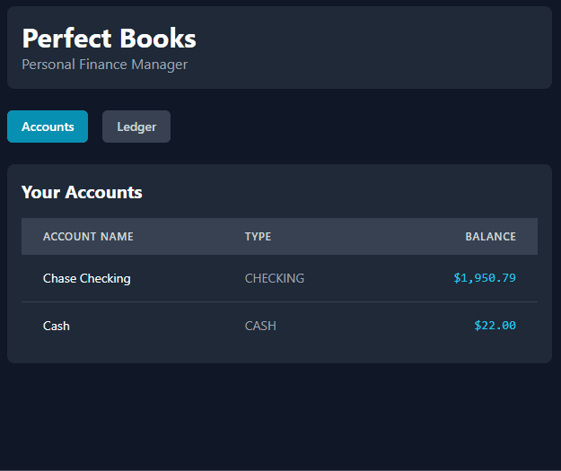

# Perfect Books - Personal Financial Management

## Project Objective

Perfect Books is a full-stack personal finance application designed to provide robust, accurate financial tracking based on the core principles of double-entry accounting. The backend is powered by a custom Python engine and a MySQL database, exposed through a Flask REST API. The frontend is an interactive and responsive dashboard built with React and styled with Tailwind CSS. The primary goal is to create a powerful, self-hosted tool for managing accounts, tracking income and expenses, and providing a clear, real-time view of one's financial health.

## Table of Contents
- [Core Features](#core-features)
- [Tech Stack](#tech-stack)
- [Web Interface](#web-interface)
- [BI-Ready Database & Analytics](#bi-ready-database--analytics)
- [Setup Instructions](#setup-instructions)
- [Database Schema](#database-schema)
- [Project Structure](#project-structure)

## Core Features

* **Double-Entry Accounting:** Every transaction generates corresponding debit and credit entries in an immutable ledger, ensuring a robust and auditable record of all financial activity.
* **Multi-Account Management:** Track balances across all your financial accounts, including checking, savings, credit cards, and cash.
* **Income & Expense Tracking:** Log all sources of income and every expense, whether recurring or a one-time purchase, to get a clear picture of cash flow.
* **REST API Backend:** A Flask-based API provides the data to the frontend, with a clear separation between the core logic and the user interface.
* **Persistent State:** The application state is stored in a MySQL database, allowing you to close the application and pick up right where you left off.

## Tech Stack

* **Backend:** Python 3
* **Database:** MySQL
* **API Framework:** Flask
* **Frontend:** React, Tailwind CSS
* **Data Analysis:** Microsoft Power BI


## Web Interface

*A new, interactive dashboard built with React is under development. A preview will be available here soon.*

## BI-Ready Database & Analytics

A core design philosophy of Perfect Books is data accessibility. The application's normalized MySQL database is structured to be "BI-Ready," allowing for a direct connection with business intelligence tools like Power BI, Tableau, or others. This enables the creation of live, interactive dashboards for deep financial analysis.

### Demonstration Dashboards (Power BI)

The following dashboards were built in Microsoft Power BI and connect directly to the application's database, providing a real-time analytical layer on top of the core transaction engine.

#### 1. The Executive Summary Dashboard

**Objective**: To provide a high-level, at-a-glance overview of the business's overall financial health and profitability. This dashboard is designed for strategic decision-making, answering the fundamental questions: "Are we profitable?" and "How is our financial position trending over time?"

* **Key Features & Insights**:
    * **Headline KPIs:** Four prominent cards display the most critical real-time metrics: Cash on Hand, Accounts Payable (AP) Due, Gross Profit, and Net Profit.
    * **Monthly Profit & Loss:** A clustered column and line chart that tracks Total Revenue against Operating Expenses on a monthly basis. The integrated Net Profit line provides a clear visual trend of the company's bottom-line performance.
    * **Operating Expense Breakdown:** An interactive donut chart that details the composition of the company's costs, revealing underlying structure and major contributors.
    * **Working Capital Trend:** A sophisticated combination chart that plots the liquid Cash Balance against short-term liabilities (Historical AP Balance) to analyze liquidity and manage cash flow.

#### 2. The Supply Chain & Operations Dashboard

**Objective**: To provide deep, actionable insights into the operational side of the business. This dashboard connects physical activities—like ordering from vendors and managing stock—to their direct financial impact.

* **Key Features & Insights**:
    * **Real-Time Validation KPIs:** Includes cards for Total Debits and Total Credits, with a centerpiece Accounting Equation card (Total Debits - Total Credits) that resolves to $0.00, providing definitive, real-time validation of the double-entry system's integrity.
    * **Vendor Scorecard:** A detailed table that evaluates supplier performance based on Average Lead Time and On-Time Delivery %, allowing for data-driven decisions.
    * **Live Stock Levels:** A table provides a real-time count of Quantity on Hand and Inventory Value for each product, serving as a central tool for stock management.
    * **Assets & Equity Chart:** A stacked column and line chart that visualizes the accounting equation over time, showing the composition of Total Assets (Cash + Inventory) against the growth of Company Equity.

## Setup Instructions

### Prerequisites

* Python 3
* A running MySQL server

### 1. Database Setup

1.  Ensure your MySQL server is running.
2.  Create a `.env` file in the project's root directory and populate it with your MySQL credentials:
    ```
    DB_HOST=your_host
    DB_PORT=your_port
    DB_USER=your_user
    DB_PASSWORD=your_password
    DB_NAME=perfect_books
    ```

### 2. Install Dependencies

Install the required Python packages using the `requirements.txt` file:
```bash
pip install -r requirements.txt
```

### 3. Initialize the Database
Run the setup script **once** from your terminal. This will create the `perfect_books` database and all required tables.
```bash
python src/setup.py
```
*Note: This script will completely drop and recreate the database each time it is run.*

### 4. Running the Application

**To use the Web Interface (Recommended):**
1. Start the backend API server in a terminal:
   ```bash
   python src/api.py
   ```
2. Open the `index.html` file directly in your web browser.

**To use the Terminal Application:**
```bash
python src/cli.py
```

## Database Schema

| Table Name | Description |
| :--- | :--- |
| `accounts` | Stores user-defined financial accounts (e.g., Checking, Savings) and their real-time balances. |
| `financial_ledger` | An immutable double-entry accounting ledger. Every event creates corresponding debit and credit entries. |
| `recurring_expenses` | Stores recurring bills and subscriptions for automated processing. |
| `loans` | Tracks loan details, including principal, interest, and payment schedules. |

## Project Structure

```
perfect-books/
├── src/               # Core Python application source code
│   ├── engine.py      # Main application engine with all business logic
│   ├── api.py         # Flask REST API server
│   ├── cli.py         # Command-line interface
│   └── setup.py       # Database initialization script
├── .env               # Stores database credentials (not committed to Git)
├── .gitignore         # Specifies files for Git to ignore
├── index.html         # React-based web interface
├── requirements.txt   # List of Python dependencies
└── README.md          # This file
```