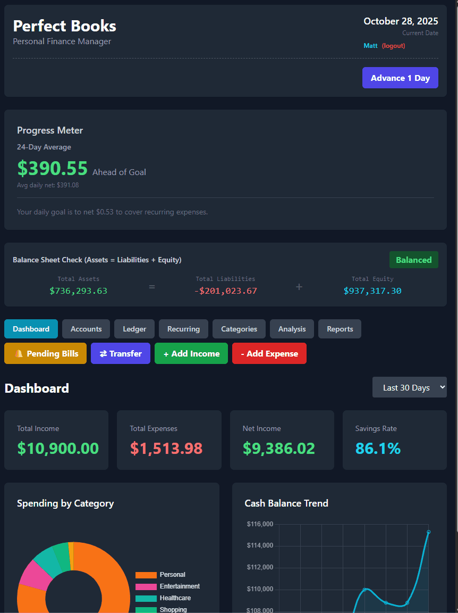

# Perfect Books - Personal Finance Management

[](https://www.python.org/)
[](https://www.mysql.com/)
[](https://reactjs.org/)
[](https://flask.palletsprojects.com/)
[](https://tailwindcss.com/)

> A sophisticated personal finance application built on double-entry accounting principles, providing secure multi-user financial tracking with real-time analytics.

### 🚀 Live Demo

**[Explore the Live Application Here](https://web-production-4abea.up.railway.app/index.html)**

*Note: This is a live portfolio demo. Please feel free to register a test account and explore the features. As this is not a production environment, please use dummy data for all entries.*

---

## 📋 Table of Contents

- [About the Project](#about-the-project)
- [Demo](#demo)
- [Core Features](#core-features)
- [Tech Stack](#tech-stack)
- [Getting Started](#getting-started)
  - [Prerequisites](#prerequisites)
  - [Installation](#installation)
  - [Running the Application](#running-the-application)
- [Architecture](#architecture)
- [Database Schema](#database-schema)
- [API Documentation](#api-documentation)
- [Roadmap](#roadmap)
- [Related Projects](#related-projects)
- [Contributing](#contributing)
- [License](#license)
- [Contact](#contact)

---

## 🎯 About the Project

**Perfect Books** is a full-stack personal finance application that brings **professional accounting principles** to personal money management. Unlike typical budgeting apps, Perfect Books maintains a complete **double-entry accounting system**, ensuring every transaction is accurately recorded and balanced.

### The Vision

Transform personal finance from simple tracking into **true financial understanding**. Perfect Books allows you to:
- Manage multiple accounts (checking, savings, credit cards, loans) in one place
- See real-time net worth and financial health
- Track income and expenses with customizable categories
- Automate recurring bills with category-based organization
- Understand your cash flow with time-based simulation
- Export data for tax preparation or advanced analysis

### Why This Matters

Most personal finance apps are glorified spreadsheets. Perfect Books proves you can have **both accuracy and usability** by:
- 📊 **Business Intelligence Ready**: Normalized MySQL schema designed for Power BI/Tableau
- 🔒 **Multi-User Security**: Complete data isolation with bcrypt password hashing
- 📚 **Educational Value**: Learn double-entry accounting through hands-on experience
- 🔬 **Data Integrity**: Immutable audit trail with transaction UUIDs
- 🎮 **Time Simulation**: Advance time to see how recurring expenses affect your finances

**Related Project:** [Digital Harvest](https://github.com/matthew-s-jenkins/digital-harvest-sim) - A business simulation that uses similar accounting architecture

---

## 🎬 Demo

### Interactive Web Dashboard



*Multi-page React interface with real-time financial tracking, expense categorization, and automated recurring bill management.*

---

## ✨ Core Features

### 💰 Financial Management

- **Multi-Account Support**: Track checking, savings, credit cards, cash, loans, and investments
- **Real-Time Balance Tracking**: All account balances update automatically with every transaction
- **Net Worth Calculation**: See your total assets minus liabilities at a glance
- **Transfer Between Accounts**: Move money with proper double-entry accounting

### 📈 Income & Expense Tracking

- **Expense Categorization**: Custom categories with color coding (10 default categories included)
- **Income Tracking**: Log all income sources with descriptions
- **Transaction History**: Complete, immutable ledger with date filtering
- **Account Filtering**: Filter ledger by specific account with running balance display
- **Transaction Reversal**: Reverse incorrect transactions (creates audit trail, prevents deletion)
- **Category Analytics**: See spending breakdown by category

### 🔄 Recurring Transactions

- **Automated Bills**: Set up monthly recurring expenses (rent, subscriptions, etc.)
- **Category Assignment**: Each recurring expense can have a category
- **Payment Automation**: Bills auto-pay on due date during time advancement
- **Visual Indicators**: Color-coded category badges show at a glance

### 💳 Loan Management

- **Debt Tracking**: Monitor outstanding balances and payment schedules
- **Payment Processing**: Make loan payments with proper accounting
- **Interest Calculation**: Automatic interest accrual (coming soon)
- **Amortization Tracking**: See principal vs interest breakdown (coming soon)

### 🔐 Security & Multi-User

- **User Authentication**: Secure registration and login with bcrypt
- **Session Management**: Flask-Login for secure session handling
- **Data Isolation**: Complete segregation - users can only see their own data
- **Password Security**: Industry-standard bcrypt hashing

### 🕐 Time Simulation

- **Auto-Advance Time**: Automatically advances to current date on login and page refresh
- **Manual Advance**: Fast-forward days/weeks to see recurring expenses process
- **What-If Analysis**: Test financial scenarios before they happen
- **Automated Processing**: Recurring expenses auto-pay when their due date arrives

---

## 🛠️ Tech Stack

| Component | Technology | Purpose |
|-----------|-----------|---------|
| **Backend** | Python 3.8+ | Business logic and simulation engine |
| **Database** | MySQL 8.0+ | Persistent storage with ACID compliance |
| **API** | Flask + Flask-Login | RESTful API with session authentication |
| **Frontend** | React 18 | Interactive single-page application |
| **Styling** | Tailwind CSS | Modern, responsive UI design |
| **Security** | bcrypt | Password hashing and authentication |
| **Analytics** | Power BI / Tableau | Business intelligence dashboards |

---

## 🚀 Getting Started

### Prerequisites

Before running Perfect Books, ensure you have:

- **Python 3.8+** installed ([Download](https://www.python.org/downloads/))
- **MySQL Server 8.0+** running locally or remotely ([Download](https://dev.mysql.com/downloads/))
- A modern web browser (Chrome, Firefox, or Edge recommended)

### Installation

1. **Clone the repository**
 ```bash
 git clone https://github.com/yourusername/perfect-books.git
 cd perfect-books
 ```

2. **Install Python dependencies**
```bash
pip install -r requirements.txt
```

3. **Configure environment variables**

   Create a `.env` file in the project root:
```env
DB_HOST=localhost
DB_PORT=3306
DB_USER=your_mysql_username
DB_PASSWORD=your_mysql_password
DB_NAME=perfect_books
```

4. **Initialize the database**

   ⚠️ **Warning**: This will drop and recreate the `perfect_books` database!

```bash
python src/setup.py
```

   You should see output confirming table creation.

### Running the Application

#### Web Interface (Recommended)

1. **Start the API server**
```bash
python src/api.py
```
   You should see: `* Running on http://127.0.0.1:5000`

2. **Open the interface**
   - **Simple**: Double-click `index.html` to open directly in your browser
  - **Server** (for better compatibility):
```bash
python -m http.server 8080
```
     Then navigate to: `http://localhost:8080/index.html`

3. **Register/Login**
   - First visit: Click "Register" to create an account
   - Subsequent visits: Login with your credentials

#### Terminal Interface (Alternative)

For a command-line experience:
```bash
python src/cli.py
```

⚠️ **Note**: The CLI is single-user and doesn't support the new multi-user architecture yet.

---

## 🏗️ Architecture

### Stateless Design

Perfect Books uses a **stateless engine** architecture:
- All state is stored in the MySQL database
- No session state maintained on the server
- Each API call is independent and authenticated
- Scalable and suitable for containerization

### Security Model

```
┌─────────────┐
│   Browser   │
│  (React UI) │
└─────┬───────┘
      │ HTTPS (with credentials)
      ↓
┌─────────────────┐
│  Flask API      │
│  + Flask-Login  │ ← Session cookies
└────────┬────────┘
         │ Validates user_id on every request
         ↓
┌─────────────────┐
│ Business Engine │ ← Stateless methods
└────────┬────────┘
         │
         ↓
┌─────────────────┐
│  MySQL Database │ ← User data segregated
└─────────────────┘
```

### Double-Entry Accounting

Every financial transaction creates balanced ledger entries:

**Example: Pay $50 for groceries from checking**
```
DR: Expenses         $50  (increase)
CR: Checking Account $50  (decrease)
```

**Example: Transfer $100 from checking to savings**
```
DR: Savings Account  $100 (increase)
CR: Checking Account $100 (decrease)
```

---

## 🗄️ Database Schema

The database follows **normalized design principles** with referential integrity:

### Core Tables

| Table | Purpose | Key Columns |
|-------|---------|-------------|
| `users` | Authentication | user_id, username, password_hash |
| `accounts` | Financial accounts | account_id, user_id, name, type, balance |
| `financial_ledger` | **Double-entry ledger** | entry_id, user_id, transaction_uuid, account, debit, credit, category_id |
| `expense_categories` | Custom categories | category_id, user_id, name, color |
| `recurring_expenses` | Automated bills | expense_id, user_id, description, amount, due_day_of_month, **category_id** |
| `loans` | Debt tracking | loan_id, user_id, outstanding_balance, monthly_payment |

### Key Design Decisions

- **Foreign Keys**: Enforce referential integrity between tables
- **Cascade Deletes**: Deleting a user removes all their data automatically
- **Indexes**: Optimized for common queries (user_id, transaction_date, category_id)
- **Decimal Precision**: All money values use `DECIMAL(10,2)` or `DECIMAL(12,2)`
- **Immutable Ledger**: Financial ledger is append-only for audit trail (no edits/deletes, only reversals)
- **Transaction UUIDs**: Group related ledger entries for reversal and tracking
- **Category Integration**: Recurring expenses and ledger entries support categorization
- **Reversal Audit Trail**: Reversed transactions marked with "REVERSED:" prefix, reversals marked with "REVERSAL OF:"

---

## 📡 API Documentation

### Authentication Endpoints

| Method | Endpoint | Description |
|--------|----------|-------------|
| POST | `/api/register` | Register new user |
| POST | `/api/login` | Login with credentials |
| POST | `/api/logout` | End session |
| GET | `/api/check_auth` | Verify authentication |

### Account Endpoints

| Method | Endpoint | Auth | Description |
|--------|----------|------|-------------|
| GET | `/api/accounts` | ✓ | Get all user accounts |
| POST | `/api/account` | ✓ | Create new account |
| PUT | `/api/account/<id>` | ✓ | Update account |
| DELETE | `/api/account/<id>` | ✓ | Delete account |

### Transaction Endpoints

| Method | Endpoint | Auth | Description |
|--------|----------|------|-------------|
| GET | `/api/ledger` | ✓ | Get transaction history (supports ?account= filter) |
| POST | `/api/income` | ✓ | Log income |
| POST | `/api/expense` | ✓ | Log expense (with category) |
| POST | `/api/transfer` | ✓ | Transfer between accounts |
| POST | `/api/reverse_transaction` | ✓ | Reverse a transaction (immutable audit trail) |

### Recurring Expense Endpoints

| Method | Endpoint | Auth | Description |
|--------|----------|------|-------------|
| GET | `/api/recurring_expenses` | ✓ | Get all recurring expenses |
| POST | `/api/recurring_expenses` | ✓ | Add recurring expense (with category) |
| PUT | `/api/recurring_expenses/<id>` | ✓ | Update expense (including category) |
| DELETE | `/api/recurring_expenses/<id>` | ✓ | Delete expense |

### Category Endpoints

| Method | Endpoint | Auth | Description |
|--------|----------|------|-------------|
| GET | `/api/expense_categories` | ✓ | Get all user categories |
| POST | `/api/expense_categories` | ✓ | Create new category |
| PUT | `/api/expense_categories/<id>` | ✓ | Update category |
| DELETE | `/api/expense_categories/<id>` | ✓ | Delete category |

### Utility Endpoints

| Method | Endpoint | Auth | Description |
|--------|----------|------|-------------|
| GET | `/api/summary` | ✓ | Get financial summary |
| POST | `/api/advance_time` | ✓ | Advance simulation time |
| POST | `/api/auto_advance` | ✓ | Auto-advance to current date (called on page load) |
| POST | `/api/sync_balances` | ✓ | Recalculate all account balances from ledger |

---

## 🗺️ Roadmap

### ✅ Current Features (v2.2)
- ✅ Multi-user authentication with bcrypt
- ✅ Double-entry accounting system
- ✅ Multi-account management
- ✅ Income and expense tracking
- ✅ **Account-filtered ledger view** with running balance calculation
- ✅ **Transaction reversal** with immutable audit trail
- ✅ **Auto-advance time** to current date on page load
- ✅ **Account balance sync** utility for data integrity
- ✅ **Recurring expenses with category support**
- ✅ **Variable Recurring Expenses** - Bills with changing amounts (electricity, water, etc.)
  - ✅ Pending transaction approval system
  - ✅ Estimated vs actual amount tracking
  - ✅ Approve or skip variable bills
- ✅ **Variable Recurring Income** - Paychecks with overtime/bonuses
- ✅ **Color-coded expense categories**
- ✅ **Loan tracking with payment breakdown**
  - ✅ Principal vs Interest split
  - ✅ Escrow tracking (for mortgages)
  - ✅ Additional fees support
  - ✅ Proper accounting for all payment components
- ✅ **Credit Card Interest Automation**
  - ✅ Automatic monthly interest calculation based on APR
  - ✅ Pending approval system for interest charges
  - ✅ Tracks last interest date to prevent double-charging
- ✅ Time simulation
- ✅ Transaction history
- ✅ Real-time net worth calculation
- ✅ React-based responsive UI


### 🔮 Planned Features (v3.0)
- [ ] Budget planning and alerts
- [ ] Financial goal tracking (savings goals, debt payoff)
- [ ] Scheduled transactions (pay bills on specific future dates)
- [ ] Receipt uploads and attachment storage
- [ ] Export to CSV/PDF for tax preparation
- [ ] Mobile-responsive enhancements
- [ ] Dark mode toggle
- [ ] Multi-currency support
- [ ] Recurring income (paycheck automation)
- [ ] Investment account tracking
- [ ] Tax category mapping

### 💡 Future Enhancements
- [ ] Native mobile app (React Native)
- [ ] Bank account integration (Plaid API)
- [ ] AI-powered expense categorization
- [ ] Spending insights and recommendations
- [ ] Collaborative accounts (joint finances)
- [ ] API webhooks for automation

---

## 🔗 Related Projects

### Digital Harvest - Business Simulation Engine

Perfect Books shares its **double-entry accounting foundation** with [Digital Harvest](https://github.com/matthew-s-jenkins/digital-harvest-sim), a retail business simulator.

**Shared Principles:**
- ✅ Double-entry accounting (Assets = Liabilities + Equity)
- ✅ Immutable financial ledger with transaction UUIDs
- ✅ Perpetual inventory system (for Digital Harvest) / Multi-account system (for Perfect Books)
- ✅ BI-ready normalized database schema
- ✅ Flask REST API architecture
- ✅ React + Tailwind CSS frontend

**Key Differences:**
| Perfect Books | Digital Harvest |
|--------------|-----------------|
| Personal finance tracking | Business simulation |
| Multi-user with authentication | Single-user simulation |
| Real-world transactions | Simulated sales & purchasing |
| Budget & expense focus | Profitability & inventory focus |

**Why This Matters:**
Both projects demonstrate that **accurate accounting** doesn't have to sacrifice **user experience**. The shared architecture proves these patterns work for both personal and business finance.

---

## 🤝 Contributing

Contributions are welcome! This project is ideal for:
- **Students** learning about accounting, databases, or full-stack development
- **Developers** interested in financial applications
- **Finance Enthusiasts** who want to contribute features

### How to Contribute

1. Fork the repository
2. Create a feature branch (`git checkout -b feature/AmazingFeature`)
3. Commit your changes (`git commit -m 'Add some AmazingFeature'`)
4. Push to the branch (`git push origin feature/AmazingFeature`)
5. Open a Pull Request

---

## 📜 License

This project is open source and available under the [MIT License](LICENSE).

---

## 📧 Contact

**Matthew Jenkins**
- GitHub: [@matthew-s-jenkins](https://github.com/matthew-s-jenkins)
- Project Link: [https://github.com/matthew-s-jenkins/perfect-books](https://github.com/matthew-s-jenkins/perfect-books)

---

## 🙏 Acknowledgments

- MySQL for robust relational database management
- Flask for lightweight, powerful API development
- React and Tailwind CSS for modern UI development
- The open-source community for inspiration and tools

---

**Built with ❤️ and Python**
